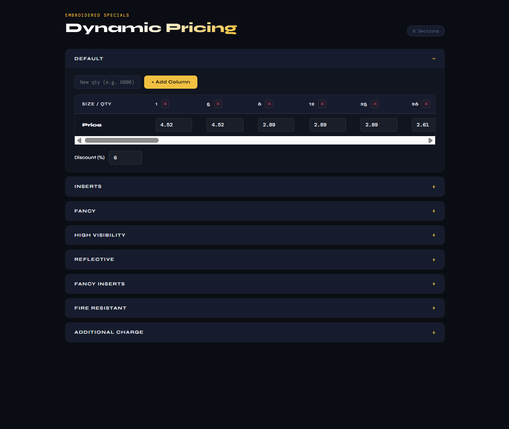

# Dynamic Pricing Manager

A Dynamic Pricing Management UI built with Angular (latest) using standalone components and signals.

## Live Demo
[View Live →](https://your-vercel-url.vercel.app)

## Features
- Renders real pricing data from nested JSON
- Signal-based state management (no NgModules)
- Editable price cells with instant reactivity
- Add / remove pricing tier columns dynamically
- Collapsible sections (Default, Inserts, FR, etc.)
- Handles flat, size-based and additional charge formats
- Special values like `dropout`, `n/a` displayed as badges

## Tech Stack
- Angular 19 (standalone components)
- Signals for state management
- Pure CSS (no styling libraries)
- No backend

## Run Locally
\`\`\`bash
npm install
ng serve
\`\`\`
